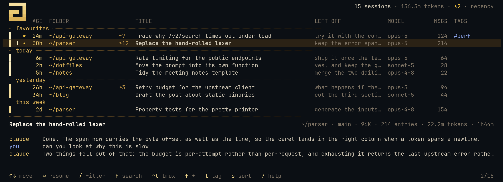
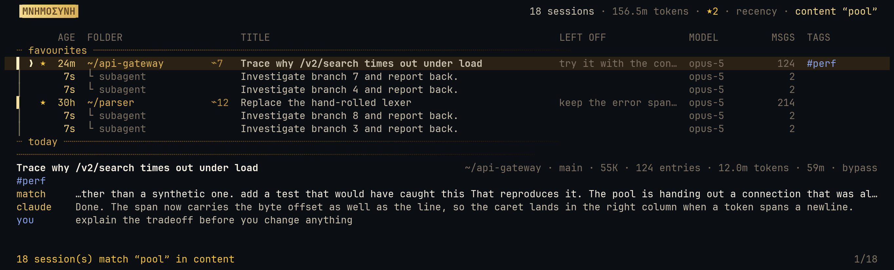
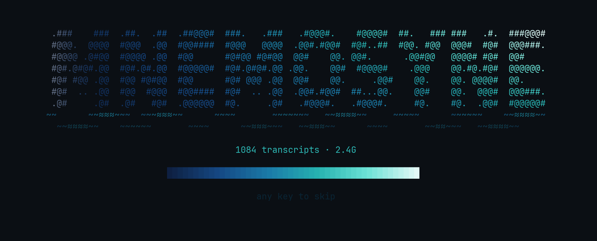
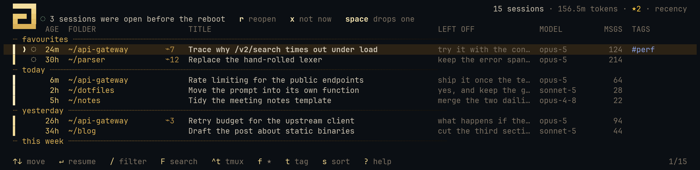
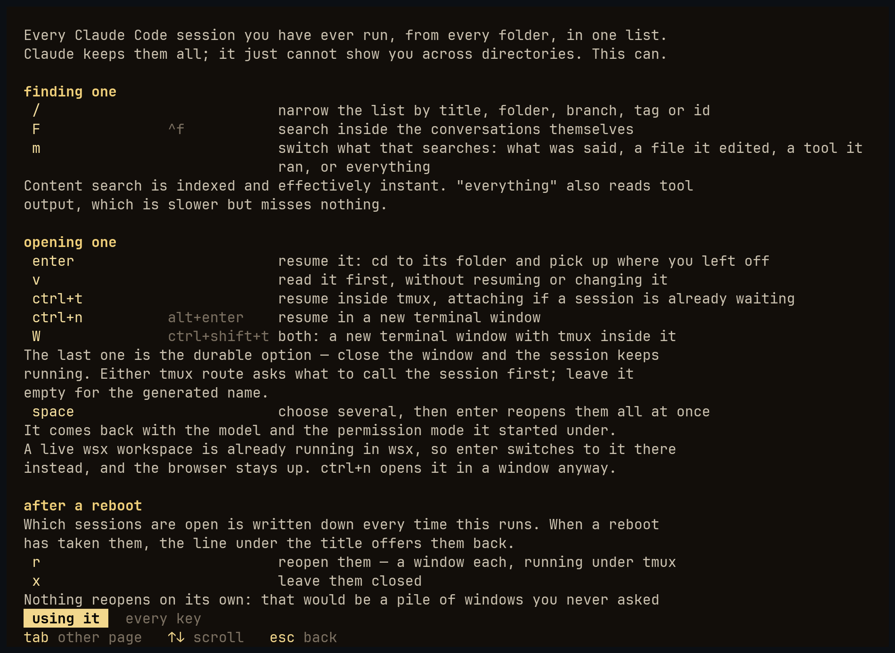

# mnemosyne

[](https://github.com/milescoviello/mnemosyne/actions/workflows/ci.yml)
[](https://github.com/milescoviello/mnemosyne/releases/latest)
[](LICENSE)

A terminal browser for your Claude Code history. Every session you have ever
run, across every folder, in one searchable list — with favourites, tags,
full-text search inside the conversations, and one keypress to reattach.

Claude Code writes every session to `~/.claude/projects/<encoded-cwd>/<uuid>.jsonl`
and nothing is lost on reboot. But `claude --resume` only lists sessions for the
directory you happen to be standing in, so there is no way to see the whole
picture. `mnemosyne` is that missing view.



```sh
curl -fsSL https://raw.githubusercontent.com/milescoviello/mnemosyne/main/install.sh | bash
mn
```

## The look

One idea runs through it: **the pool**. Mnemosyne is the spring of
memory, so the list is a water surface and older sessions sink.

A **depth gutter** runs down the left edge, coloured on the water ramp by each
session's age — today's are pale foam at the surface, last year's fade into
deep indigo. Age becomes something you see rather than read, and the age text
sits on the same ramp. Subagents hang off their parent on a thinner `│`.

**Date bands are ripples**, not rules, and they dissolve toward the right
instead of stretching a hard line across the terminal. They appear only when
sorting by recency, where time order makes them mean something.

The **wordmark is lit letter by letter** along the same ramp, and every piece
of chrome — cursor `❯`, band `≈`, prompt `⌇`, selection `◆` — comes from one
small water alphabet. No borders anywhere; structure comes from alignment.

At a wide terminal a title column alone leaves a sixty-column void in every
row, so the leftover space becomes a **LEFT OFF** column carrying the last
thing you said. When a session has no AI title its opening prompt becomes the
title, and that is often also the last prompt, so the duplicate is suppressed
rather than printed twice. Below about 80 columns the column is dropped and
the rail carries the cue instead.

## Wide characters

Columns are measured in terminal cells, not characters. CJK and emoji occupy
two cells each, so a title of eight characters can be sixteen columns wide;
measuring it as eight padded the row too narrow, slid every column after it
to the left, and pushed the last one off the edge — where clipping hid the
evidence. Titles are also stripped of control characters, which are counted
when a column is measured, draw nothing, and would otherwise hand an `ESC`
in a transcript straight to your terminal.

## Mouse

It is a pointer-driven list as much as a keyboard one.

| | |
|---|---|
| click a row | select it |
| click it again | resume it |
| right-click | favourite it |
| wheel | scroll |
| click a column heading | sort by that column |
| click a `⌁n` count | open that session's subagents |
| `M` | mouse off, so the terminal can select text again |

## Tags

Tags are the organising axis, not folders — most sessions tend to share one
working directory, so the folder column is nearly constant while tags are not.

`t` tags the session under the cursor, or **every session in the selection**
if you have picked several with `space`. Inside that prompt, `-name` removes a
tag and `old>new` renames one everywhere it appears, merging if the
destination already exists. `T` filters to a single tag, with completion over
the tags you already use.

Everything clickable records its screen span as it draws, and the mouse
handler tests against what was actually rendered — so the hit areas cannot
drift out of step with the layout. Clicks and keys both dispatch through one
`Action` enum, so the two can never disagree about what a command does.

Mouse reporting takes over the terminal's own text selection, which is why
`M` (or `--no-mouse`) exists. In most terminals holding shift while dragging
also bypasses it.


No borders, aligned columns, one footer line. The full key list lives behind
`?` rather than permanently on screen.


## What it does

**Finds things.** `/` fuzzy-filters titles, folders, branches and tags. `F`
searches *inside* the conversations — the actual text of what you and Claude
said — across the whole corpus in about a fifth of a second. `m` switches that
between three questions: what was *said*, which *files* a session actually
edited, and which *tools* it used.

**Remembers what matters to you.** `f` favourites a session and pins it to the
top. `t` tags it; `T` filters to one tag. `N` attaches a private note. All of
this lives in one small JSON file, separate from the disposable index.

**Shows you the real titles.** Claude Code generates a title for each session
and records it in the transcript. Most tools ignore it and fall back to the
first user message, which turns a pasted multi-paragraph prompt into a useless
list entry. `mnemosyne` uses the real title, plus the *last* prompt — the best
single cue for "where was I".

**Knows what's already running.** Live sessions are marked, and pressing enter
on one tells you its pid instead of silently attaching a second client to the
same transcript.

**Opens where you want it.** `enter` resumes in this terminal, `ctrl+n` in a
new terminal window, `ctrl+t` in tmux, and `W` (or `ctrl+shift+t`) in a new
terminal window *with tmux inside it* — the durable one, because closing the
window leaves the session running. Either tmux route asks what to call the
session first; leave it empty for the generated `mn-<id>`.

**Survives a reboot.** Which sessions are open is written down every time
`mn` runs. After a reboot it offers them back — `r` reopens each in its own
window with tmux underneath, so closing a window no longer kills the session.
Nothing reopens on its own; see [After a reboot](#after-a-reboot).

**Restores the model.** If a session ran on a specific `--model`, resuming
brings it back on that model rather than quietly dropping to the default.

**Surfaces subagents.** Subagent transcripts live in a nested directory and are
normally invisible. `a` reveals them; `→` expands a session's children.

## Install

```sh
curl -fsSL https://raw.githubusercontent.com/milescoviello/mnemosyne/main/install.sh | bash
```

That fetches a prebuilt static binary (checksum verified), installs it to
`~/.local/bin/mnemosyne`, and wires up the `mn` shell function — dropping it
into `~/.config/fish/functions/` for fish, and appending one `source` line to
`.bashrc` / `.zshrc` for bash and zsh, since those have to source it for the
`cd` to happen in your shell. Re-running is safe; the line is added once. No
Rust needed.

From a clone, or to build it yourself:

```sh
git clone https://github.com/milescoviello/mnemosyne
cd mnemosyne
./install.sh            # prebuilt if available, otherwise builds
./install.sh --build    # always build from source
```

Then:

```sh
mn
```

The shell function exists because `mnemosyne` cannot change your shell's
working directory — no child process can. The binary draws the interface on
**stderr** and prints its decision to **stdout**; the function reads that and
performs the `cd` plus `claude --resume` itself. It is a few lines long and
you can read all of it in `shell/mn.fish`.

## Staying current

It updates itself. Every interactive start asks GitHub for the latest release
on a background thread and installs it if there is a newer one. Two things it deliberately does not do: block the interface
waiting for the network, and swap the binary out from under the process you
are using. The new one is renamed into place — atomic, and harmless to the
running image — and takes effect next time you start. When that happens the header and the
status line both say `v0.3.1 installed — restart to update`; if a newer
release exists but could not be installed, they say so instead rather than
staying quiet.

```sh
mn --check-update     # is there a newer one?
mn --update           # install it now
mn --no-update        # skip the check this run
```

To turn it off for good, in `~/.claude/mnemosyne/config.toml`:

```toml
[update]
auto = false
check_every_hours = 0   # 0 is every start; set hours to check less often
```

`MNEMOSYNE_NO_UPDATE=1` does the same for one run. Downloads are checksum
verified, and a mismatch refuses to install rather than warning and carrying
on.

## Searching



`/` filters the list. `F` searches *inside* the conversations.

Content search runs against a full-text index, so it answers in
**milliseconds** rather than re-reading the corpus:

| query over 1,084 transcripts | indexed | exhaustive scan |
|---|---|---|
| `checkpatch` | 0.002 s | 0.195 s |
| `page fault` | 0.006 s | 0.69 s |
| `the` | 0.03 s | 4.5 s |

The index is small because a transcript is mostly not prose. Measured over a
random sample here, **2.2%** of 2.5 GB is anything a person said — the rest is
tool output, base64 and JSON. So the index holds what was said, thought, and
run (text blocks, thinking blocks, and shell commands) and comes to about a
tenth of the corpus.

That is a deliberate trade: it does not cover tool *output*, which is the
other 98%. `m` cycles the search between **content** (indexed), **file
touched**, **tool used**, and **everything** — the last reads every byte and
is the slow, complete one. A content search that finds nothing falls back to
the exhaustive scan automatically rather than claiming there is nothing
there.

Two exclusions make the results worth trusting. Memory files and
`<system-reminder>` blocks are injected into every session, so indexing them
would make every session match any word in yours; they are stripped. And
base64 image payloads spell short words by chance, so the exhaustive scan
rejects matches inside them.

## Opening several at once

`enter` hands this terminal over, so the browser has to close for it. A
window of its own does not: `ctrl+n`, `W` and `ctrl+shift+t` open the
session elsewhere and **leave the picker where it is**, so you can open a
second and a third without starting over.

That works because the plan is streamed. `mnemosyne` prints each choice as
you make it and keeps running; the shell reads the lines as they arrive
rather than waiting for the process to exit, and only `here` and `tmux`
arrive on the way out. Two details this depends on:

- The shell's progress lines are held back until the browser has finished
  with the screen. Printing them immediately drew over the interface, which
  looked like the tool had half-crashed.
- Inside `while read`, the loop's stdin *is* the pipe, so any command in the
  body that reads stdin eats the next plan line — `tmux` does exactly that,
  and the second window never opened. bash reads on fd 3; both shells give
  the loop body `/dev/null` for input, which also stops it taking keystrokes
  from the browser that is still running.

## Starting up

The list goes up from the cache, and any rescan runs behind it. That is the
whole rule, and it is what keeps a start under a second whatever the index
is doing.

An update that changes what the scanner derives used to be the exception: the
cached rows were thrown away, so there was nothing to draw and the animation
sat there for twelve seconds re-reading 2.5GB — on this corpus, two
transcripts alone are 403MB and 367MB. Rows written by an older scanner are
kept and shown now. They are never *reused* to skip reading a file, and the
new version is only recorded once a full rescan has actually happened, so
the new logic cannot be skipped; the rows are just something honest to look
at while it runs. The header says `indexing…` until it lands.

The one case that still waits is a genuinely empty cache — a first run, or
after deleting `index.db` — because there is nothing to show instead. There
the animation reports progress, does not offer to skip (it would drop you on
a screen that cannot change yet), and says the wait happens once. `ctrl+c`
leaves at any point.

## The opening animation

Mnemosyne is the spring of memory in the underworld — the counter-pool to
Lethe, which souls drank in order to forget. So the name surfaces out of a
rippling pool, lit by a gradient running from deep water to pale foam with a
shimmer band that leads the reveal and then keeps sweeping:



The wordmark is **tonal ASCII art** — neither an outline font nor solid
blocks. The name is rasterised with anti-aliasing and each character cell
mapped onto the density ramp ` .:-+*#@`. Generated by `tools/gen-wordmark.py`
and baked into the source, so nothing is rasterised at runtime and the binary
has no image dependency.

Getting it *legible* took two things, and the first was the whole game. Set in
lowercase the word is about 16:1, so even 96 columns bought only four rows of
x-height — nowhere near enough cells to draw a letter with. Uppercase is
~13:1 and spends no rows on ascenders or descenders. Second, an S-curve on the
tone: mid-tones scattered through the inside of a stroke read as noise, so the
curve solidifies stroke interiors and leaves the falloff where it belongs, on
the edges.

Three sizes are baked in — 96, 84 and 68 columns — because tonal art needs
resolution. Below 68 the letters collapse and narrower terminals get a
letter-by-letter reveal in the same gradient instead.

Columns that have not surfaced yet show only the highest wave crests — filling
them densely fought the art instead of framing it. The pool sums two sine
frequencies, because one alone produces long uniform runs that read as teeth.
Roughly 3,500 distinct colours are in play per frame.

It is covering real work — the index builds on a background thread while this
runs — and lasts until indexing finishes or about 1.5s has passed, whichever
is later. Any key skips, and that keypress is swallowed so it cannot act on
the session under the cursor. When there is genuine work left the bar reports
it; on a warm index the bar fills with the reveal and the counts below state
the real totals. The bar never steps backwards when the source changes under
it.

Turn it off with `--no-splash` or `MNEMOSYNE_NO_SPLASH=1`. `?` shows the same
wordmark over the key reference.

## After a reboot

A reboot takes every running session with it, and a list of two hundred
transcripts cannot tell you which three you actually had open. So `mn` writes
that down: every time it runs, and every time it launches something, the set
of open sessions is recorded in `workspace.json`.

After a reboot the line under the title says so:



The marker is hollow rather than solid on purpose: `●` means *running now*
everywhere else in the interface, and these are the sessions that are not.

`r` opens each one in its own terminal window, running under tmux. Both
halves matter: the window is so you can see it, and tmux is so that closing
the window — or the whole desktop session — leaves the work running instead
of killing it. `x` puts the offer away; `mn --reopen` still acts on it
afterwards, which is what makes dismissing it safe. Either way you are asked,
because restoring on login without asking means a pile of windows and a
Claude process each before you have said you want any of them.

Sessions whose folder no longer exists are skipped, and so is anything
already running — reopening one of those would put a second client on a
transcript that already has one.

**There is no daemon.** Nothing runs at shutdown to take a final snapshot, so
the record is as fresh as your last `mn` — in practice, most of the way
there. What it can see also varies by platform:

| | what gets recorded |
|---|---|
| Linux | every running session, read from `/proc` |
| macOS, BSD | what `mn` launched, plus anything waiting in tmux |

There is no session id in a Claude process's environment, so a session is
identified exactly only when its command line carries `--resume <uuid>` —
which everything `mn` starts does. A bare `claude` you started by hand is
matched by working directory instead, and two of those in one folder look
like one session.

The offer is only made when a reboot has actually happened, which is
established from `/proc/sys/kernel/random/boot_id` on Linux and from
`kern.boottime` elsewhere. On a platform where neither can be read, the offer
is never made on its own and `mn --reopen` is the way in.

## tmux

`ctrl+t` resumes inside tmux. `W` — or `ctrl+shift+t` where your terminal can
send it — opens a **new terminal window with tmux inside it**, which is the
combination worth knowing: the window is so you can see it, and tmux is so
that closing the window, or logging out, leaves the work running.

Both ask what to call the tmux session. `mn-026bcdb5` tells you nothing in
`tmux ls`; `eft-work` does. Anything tmux cannot address is flattened —
`:` and `.` are target syntax — and an empty answer keeps the generated name.

A chat already running in tmux is never started twice. It is found by the
command its pane was started with rather than by the session name, so the
guard keeps working once names are yours to choose:

```sh
tmux list-panes -a -F '#{session_name}	#{pane_start_command}'
```

**On `ctrl+shift+t`:** a terminal can only send it as a distinct key if it
speaks the kitty keyboard protocol, and inside tmux that additionally needs
`set -s extended-keys on` in your tmux.conf. Without both, it arrives as
plain `ctrl+t` and resumes in tmux the ordinary way. `W` has no such
requirement.

## Permissions

A session resumes under the permission mode it was **started** in, read from
the transcript, the same way the model is restored:

| recorded mode | resumed with |
|---|---|
| `bypassPermissions` | `--dangerously-skip-permissions` |
| `plan`, `acceptEdits`, `auto`, `manual`, `dontAsk` | `--permission-mode <mode>` |
| `default` | nothing — it started with prompts on, so prompts stay on |
| *nothing recorded* | `--dangerously-skip-permissions` |

`default` is deliberately absent from the `--permission-mode` column: it is not
one of that flag's accepted values, and it already means "behave normally".
The last row covers older transcripts written before the field existed.

Overrides, both of which win over the recorded mode:

```sh
mn --ask     # resume with permission prompts on, whatever it was started in
mn --dangerously-skip-permissions   # force bypass
```

Anything `mn` does not recognise is forwarded to `claude` untouched, so
`mn --verbose` works. `mn`'s own flags (`--no-splash`, `--subagents`,
`--no-model`, `--ask`) are filtered out before the rest is handed over.

## Non-interactive use

Handy from scripts, and from inside a Claude session that wants to find its own
past work.

```sh
mnemosyne --list                      # TSV of every session
mnemosyne --json                      # same, as JSON
mnemosyne --search "connection reset" # which sessions discussed this
mnemosyne --search Cargo.toml --search-mode file   # which sessions edited it
mnemosyne --search WebSearch --search-mode tool    # which sessions used it
mnemosyne --stats                     # corpus summary
mnemosyne --refresh                   # rebuild the index and exit
mnemosyne --restore 5                 # reopen the 5 most recent, each in a window
mnemosyne --reopen                    # put back what was open before the reboot
```

`--search-mode file` means *edited through a file tool* — it matches the
path recorded by Read, Write and Edit. A file changed by a shell command is
not in that list, because no path was recorded; use `everything` to catch
those too.

Bad arguments are refused rather than absorbed: an unknown option, a
`--search-mode` that is not one of the four, or a `--restore` count that is
not a positive number all exit 2 and say what was wrong. Running the browser
with no terminal says so, instead of reporting `No such device or address`.

Windows opened for you are started with `setsid`, in a session of their own.
`disown` is not enough: it only removes the job from the shell's table, so
the child keeps the shell's process group and session, and closing the
terminal you ran `mn` in sent SIGHUP to every window it had just opened.

`--restore` skips anything already running or already in a tmux session, and
anything whose directory has since been deleted. `--reopen` does the same,
and works even after the offer has been dismissed — so it is the one to put
in a login script if you would rather not be asked.

## Why re-indexing is quick

A full re-index took 39 seconds, and almost none of it was reading
transcripts. Tokenising all 157MB of prose costs **1.7s**; the other 41
seconds were the deletes. `body` is an FTS5 table and `path` is declared
`UNINDEXED`, so `DELETE FROM body WHERE path = ?` reads the entire table —
once per transcript, eleven hundred times over.

A small `body_ref` table maps a path to its rowid, which FTS5 deletes
directly. Nothing else changed:

| | before | after |
|---|---|---|
| build from nothing | 39s | **1.8s** |
| re-index after an update | 39s | **3.6s** |
| warm, nothing changed | 0.4s | 0.4s |

The map has to stay in step with the rows or the wrong text gets deleted,
so the schema check counts both and rebuilds if they ever disagree.

## How it stays fast

The corpus this was built against is 2.5 GB across ~1,100 transcripts, with
individual sessions over 400 MB. Measured on that corpus:

| operation | time |
|---|---|
| first index, cold page cache | 0.50 s |
| re-index, nothing changed | 0.02 s |
| full-text search, all sessions | ~0.2 s |
| preview any session | constant, regardless of size |

Four things get it there:

**No JSON parsing in the hot path.** A byte-level test classifies each line and
only the handful that actually carry a title or a prompt are handed to a real
JSON parser.

**The right byte-level test.** Looking for the first `"type":"` in a line is
wrong: message lines embed a nested `"type":"text"` content block *before* their
own top-level `type`, which misclassifies about half of all lines. Metadata
lines instead begin literally with `{"type":"`, and message lines carry
`"role":"user"` / `"role":"assistant"` near their front. Those two tests
together were verified exact over thousands of lines — no misses, no false
positives.

**Append-only incremental scanning.** Transcripts only ever grow, so the index
records how many bytes it has consumed and later reads just the new tail. An
untouched session costs one `stat()`.

**Previews read backwards.** Showing the last few messages of a 400 MB session
means seeking to the end, not reading 400 MB. Preview cost is independent of
session size.

## Search precision

Naive substring search over raw transcripts is nearly useless, for two reasons
that are easy to miss:

- **Injected context.** Memory files and `<system-reminder>` blocks are pasted
  into every session's context. Search for any word that appears in yours and
  you match *every session you have ever run*. Matches inside injected spans,
  and inside `attachment` records, are excluded.
- **Base64.** Pasted images arrive as long unbroken base64, whose alphabet
  cheerfully spells short words by chance. Prose contains whitespace and blobs
  do not, so matches in a wide window with no whitespace are rejected.

Together these cut a representative query from 58 hits to 36 real ones.

**What counts as prose.** A message is not always a list of content blocks;
plenty are stored as `"content":"<the text>"`, and those are overwhelmingly
what *you* typed rather than what Claude replied. Taking only block content
left 16% of the prose in a real corpus — 7MB across 341 of 344 transcripts —
unfindable by the default search, and it was invisible because Claude's reply
usually repeats your words, so the session still turned up. Both shapes are
indexed. Tool *output* still is not: the string form is anchored on the
message's role, so a `tool_result` payload stays out.

**A phrase matches the word it starts.** A single word has always been a
prefix query, so `pool` finds "pooling". A phrase was not, so
`connection pool` missed "connection pooling" and `page fault` missed
"page faults" — the same search behaving two ways depending on its length.
Both are prefix queries now: on this corpus `kernel patch` went from 7 hits
to 17, `permission mode` from 6 to 13.

**The index and the scan agree.** They did not: the scan skipped `isMeta`
lines and the index harvested them, so the same query answered differently
depending on which engine ran — and the fallback to scanning only fires when
the index finds *nothing*, so a partial answer never triggered it. Both now
use one predicate, checked against the whole line rather than its first 64KB,
because `isMeta` lands wherever the writer put it.

## Help



`?` opens a help screen with two pages. The first explains how to use the
thing — how to find a session, how to open one, and what every marker in the
list means, including the depth gutter and the `⌁` subagent count. The second
is the full key reference. `tab` moves between them, the arrows scroll, `esc`
goes back.

Arrow keys, `enter`, `esc` and `tab` are the documented path and are always on
screen. Vim motions (`j k g G h l`) work as silent aliases if you want them,
and are never required.

## Files it touches

| path | what |
|---|---|
| `~/.claude/projects/**/*.jsonl` | read only, never modified |
| `~/.claude/mnemosyne/index.db` | disposable cache; delete it any time |
| `~/.claude/mnemosyne/meta.json` | your favourites, tags and notes |
| `~/.claude/mnemosyne/workspace.json` | which sessions were open, for reopening after a reboot |

Notes and tags out of `meta.json` are cleaned of control characters before
anything is drawn. That file is edited by hand and synced between machines,
and everything in it reaches a terminal — an escape sequence in a note is a
file deciding what your screen does.

Only `meta.json` cannot be regenerated, so it is written via a temp file and
rename and kept deliberately small and readable. `workspace.json` is written
the same way; losing it costs you one reopen offer and nothing else.

## Retention warning

Claude Code deletes local transcripts after `cleanupPeriodDays`, which
**defaults to 30 days** by last activity and runs at startup. If you want a
long history to browse, raise it in `~/.claude/settings.json`:

```json
{ "cleanupPeriodDays": 3650 }
```

There is no literal "never". Already-deleted transcripts are unrecoverable.

## Tokens

Transcripts record their own token usage, so `mn` reads it. The header
carries the machine-wide total, there is a **TOKENS** column at wide
terminals that `s` will sort by, and each session's own count sits in the
rail:

```
  ⌇ mnemosyne                      331 sessions · 90.72b tokens · ●2 live · recency
```

The header total is deliberately **not** filtered — it is a property of the
corpus rather than of whatever you are looking at, and a figure that moved
while you typed would be hard to read. Narrowing to one tag changes the
session count beside it, not the total.

As the terminal narrows the header drops whole facts rather than cutting one
in half, worst-first: the sort label goes, then the token total, then the live
count. Anything explaining *why* the list looks the way it does — an active
filter, a tag, a selection — outlives them, since without it the view is
inexplicable.

The same numbers, broken down:

```
$ mnemosyne --stats
tokens, every session on this machine
  input            19.8m
  output          334.7m
  cache read      89.03b
  cache write      1.30b
  total           90.68b
```

Counts only, and only local transcripts. Turning usage into money, and doing
it across more than one machine, is what `ccusage` is for.

## Configuration

Entirely optional — with no file the defaults are what the tool has always
used. `mnemosyne --write-config` drops a commented one at
`~/.claude/mnemosyne/config.toml`:

```toml
# The water ramp, deep to pale. Every gradient samples it.
ramp = ["#0e2042", "#154884", "#1a7aa8", "#26b2b0", "#6ce2d6", "#e2f8f6"]
accent = "cyan"
favorite = "yellow"

[splash]
enabled = true
floor_warm_ms = 420     # how long it lingers when there was no work to cover

[start]
mouse = true
preview = true
```

Command-line flags always beat the file. A malformed config is reported once
and then ignored — losing your colours is not a reason to refuse to start.

## Failure modes

The index is derived data, so it is treated that way. A corrupt database is
deleted and rebuilt rather than reported; if the location cannot be written to
at all — read-only home, full disk — it falls back to an in-memory index,
which is slower but works. Neither case stops the tool starting, and both used
to.

Your favourites, tags and notes are the only thing here that cannot be
rebuilt, so `meta.json` is written atomically and keeps three generations
behind it (`meta.json.1` … `.3`). The rotation skips identical saves, so
toggling one favourite repeatedly cannot push real history out of the window.

Live-session detection reads `/proc`, so it only works on Linux. Elsewhere it
says so rather than reporting that nothing is running, which looks identical
to a broken feature.

## legacy/

`legacy/` holds the tools this replaced — the original `fzf` + Python picker,
and the two small fish functions for listing and reopening sessions. See
`legacy/README.md`. The picker needs nothing but `fzf` and `python3`, so it is
worth keeping as a fallback if the binary is ever missing:

    ./legacy/install-classic.sh

## Development

```sh
cargo test          # 227 tests, no network and no fixtures on disk
cargo clippy --all-targets -- -D warnings
tools/shell-selftest.sh           # the fish and bash wrappers, 50 checks
python3 tools/gen-wordmark.py     # regenerate the logo (needs Pillow)
python3 tools/demo-corpus.py /tmp/demo-home        # invented sessions
HOME=/tmp/demo-home python3 tools/screenshot.py docs/list.png 150 24
python3 tools/demo-corpus.py /tmp/demo-home --reopen-offer   # + a pre-reboot set
HOME=/tmp/demo-home python3 tools/screenshot.py docs/reopen.png 150 16
python3 tools/tui-drive.py '["./target/release/mnemosyne","--no-splash"]' '["DOWN","v"]'
```

The screenshots are taken against a **fabricated corpus**, never a real one.
`tools/demo-corpus.py` writes fifteen invented sessions into a throwaway
`HOME` — made-up titles, prompts, folders and replies — so the images can be
regenerated by anyone without publishing their own history. The first set
committed here did show real sessions, which is exactly the mistake this
exists to prevent.

`tools/screenshot.py` renders the interface to a PNG by running it in a
pseudo-terminal and drawing the parsed escape codes with a monospace font, so
the images above can be regenerated rather than re-grabbed by hand — no
desktop required, which means it works over ssh and in CI. It follows a font
fallback chain the way a terminal does, because a renderer that does not will
show boxes where a real terminal shows the glyph.

That is not hypothetical. The wordmark prefix used to be `⌇` (U+2307), and
nothing in fontconfig's fallback chain for plain `monospace` carries it — it
had been rendering as a box, and no text capture could reveal that, because
the codepoint survives whether or not the font can draw it. A test now holds
every non-ASCII glyph the interface draws against a vetted list.

`tools/shell-selftest.sh` covers the part `cargo test` cannot see. About a
third of the work of resuming a session happens in the shell wrapper —
splitting the plan into fields, mapping permission modes, creating the tmux
session, opening the window — and none of it is Rust. It runs both wrappers
against stub `mnemosyne`, `claude` and terminal binaries, with tmux on a
private socket so it can never disturb real sessions. It immediately found
two bugs in the bash wrapper: `read` with tab as the separator collapses
runs of tabs, so a session with no recorded model had every later field
shifted along by one, losing its title and passing `--model default` to
Claude.

`tools/tui-drive.py` runs the interface in a pseudo-terminal and rebuilds what
it drew, so the TUI can be exercised in CI or from a script. It speaks
synthetic mouse events too, and `CLICKFIND:<glyph>` locates a glyph and clicks
it in the same pass — finding coordinates in one run and clicking in another
races against a transcript corpus that is being appended to while you look at
it.

The tests pin the findings that were expensive to discover — that a line
cannot be classified by its first `"type":"`, that injected context and base64
have to be excluded from search, that permission mode is read from the start
of a session, that a scanner change must invalidate the cache — and the bugs
that actually shipped.

The interface is rendered into a `TestBackend` at 189 terminal sizes, from
20×4 to 240×50, in every mode: filtered, grouped, searching, mid-typing, help
on both pages, the viewer, and with nothing matching at all. That suite caught
two real bugs the first time it ran: a header that still collided at twenty
columns, and a word-wrapper that silently widened the width it was handed.
Anything to do with layout arithmetic has broken here before, always at a size
nobody tried by hand.

Alongside that: the scan-to-index-to-search pipeline end to end on synthetic
transcripts, mouse hit-testing against a recorded layout, and the cases that
tend to be skipped — an empty transcript, malformed JSON mid-file, CRLF, a
file with no trailing newline, a transcript that shrank, unicode titles, and
a search query made of FTS5 syntax.

## License

MIT.
